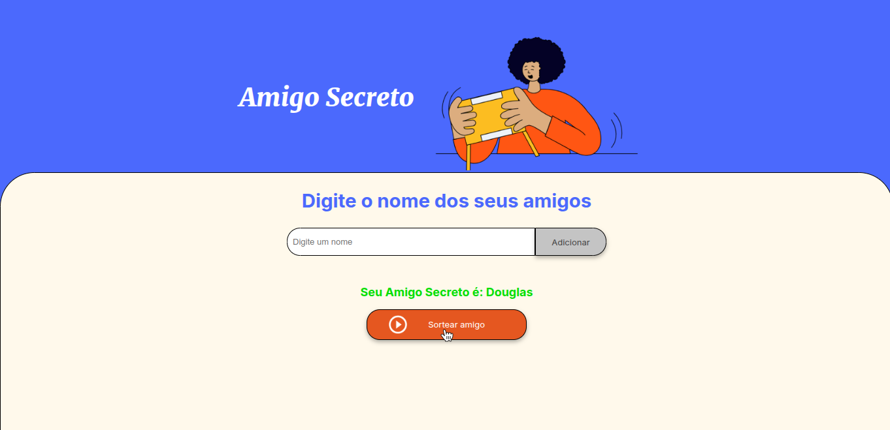

# Amigo Secreto 🎁

Este projeto é uma aplicação simples de Amigo Secreto desenvolvida utilizando **HTML, CSS e JavaScript** puro. Ele permite adicionar participantes, realizar o sorteio automaticamente e exibir o nome do amigo sorteado.

## 📌 Funcionalidades

- Adicionar participantes à lista.
- Remover participantes antes do sorteio.
- Realizar o sorteio aleatório sem repetir nomes.
- Interface amigável e responsiva.

## 📸 Capturas de Tela

### Tela Inicial - Adicionando Participantes


### Após o Sorteio - Exibindo os Resultados


## 🚀 Como Usar

1. Clone ou baixe este repositório.
2. Abra o arquivo `index.html` em seu navegador.
3. Adicione os participantes clicando no botão correspondente.
4. Clique no botão "Sortear" para realizar o sorteio.
5. Veja o nome sorteado na tela.

## 🛠️ Tecnologias Utilizadas

- **HTML** - Estrutura do projeto.
- **CSS** - Estilização da interface.
- **JavaScript** - Lógica do sorteio e manipulação do DOM.

## 📄 Código Principal (Trecho JavaScript)
```javascript
let listaDeNomes = [];

function adicionarAmigo(){
    let nome = document.getElementById('amigo').value.trim();
    if (nome) {
        listaDeNomes.push(nome);
        let li = document.createElement('li');
        li.textContent = nome;
        document.getElementById('listaAmigos').appendChild(li);
        document.getElementById('amigo').value = '';
    }
};

function sortearAmigo(){
    if (listaDeNomes.length > 0) {
        let nomeSorteado = listaDeNomes[Math.floor(Math.random() * listaDeNomes.length)];
        document.getElementById('listaAmigos').innerHTML = '';
        let li = document.createElement('li');
        li.textContent = "Seu Amigo Secreto é: "+nomeSorteado;
        document.getElementById('resultado').appendChild(li);
        this.disabled = true;
        listaDeNomes = [];
        document.getElementById('amigo').value = '';
    }
};
```
Feito por Douglas Teyh

